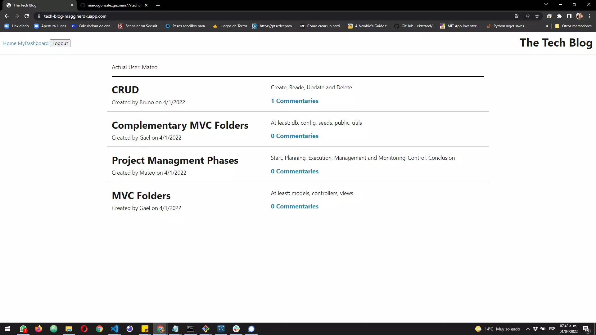

#  👓 Tech Blog

## 📄 Description

This is a blog app where developers can publish posts and comment others developer´s posts about technical concepts, recent advancements, and new technologies (Content Management System-CMS). The app use the Model-View-Controller architecture. Handlelbars for views, mysql-sequelize packages for models and express appi for controllers.

## ⚙⚙ Web Page Functionality

The following image shows the Tech Blog application's appearance and functionality:

You can get in into the App in the next link in Heroku [Tech Blog](https://tech-blog-magg.herokuapp.com//) for testing.

